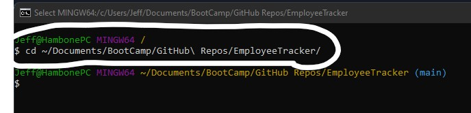
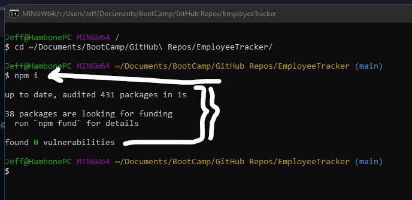
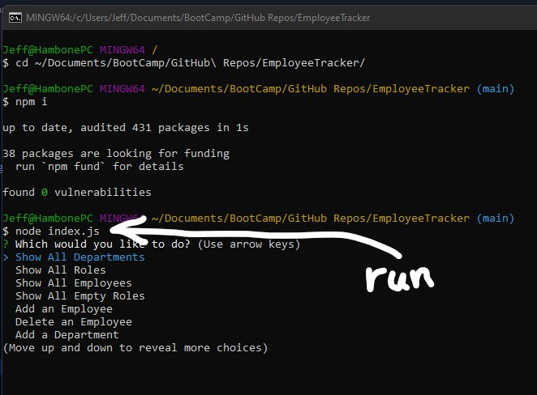
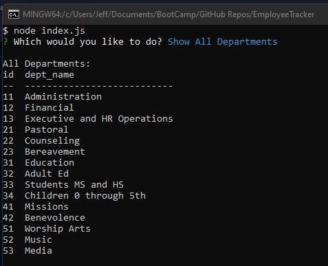

# EmployeeTracker

## Video Demonstrations

## Project Description
This applocation we receive user input using the Command-Line Interface (CLI) to interact with a MySQL database, to make changes to a company's Employee, Roles, and Departments database.

## Instructions Before Use

- From your Terminal of choice, navigate to the folder with the index.js file.
--- 

- Install dependencies.  Enter the following command, without the quotation marks:  " npm i "
--- 

- Enter the following command, without the quotation marks:  " node index.js "
--- 

## Using the Program

- It will show all the contents of each, Departments, Roles, and Employees.
--- 

