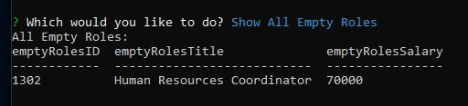

# EmployeeTracker

## Video Demonstrations

## Project Description
This applocation we receive user input using the Command-Line Interface (CLI) to interact with a MySQL database, to make changes to a company's Employee, Roles, and Departments database.

## Instructions Before Use

- From your Terminal of choice, navigate to the folder with the index.js file.    
    

- Install dependencies.  Enter the following command, without the quotation marks:  " npm i "    
    

- Enter the following command, without the quotation marks:  " node index.js "    
    

## Using the Program

- It will show all the contents of each, Departments, Roles, and Employees.    
    
    
    

- It will show, if true, that there are no empty roles.    
    

- It will show a list of the empty roles, which can be added/hired.    
    

- It will delete/fire an employee.    
    

- It will add a new employee.    
    
    
    

- It will add a new department.    
    

- It will add a new role.    
    

- It will allow you end the app.    
    

